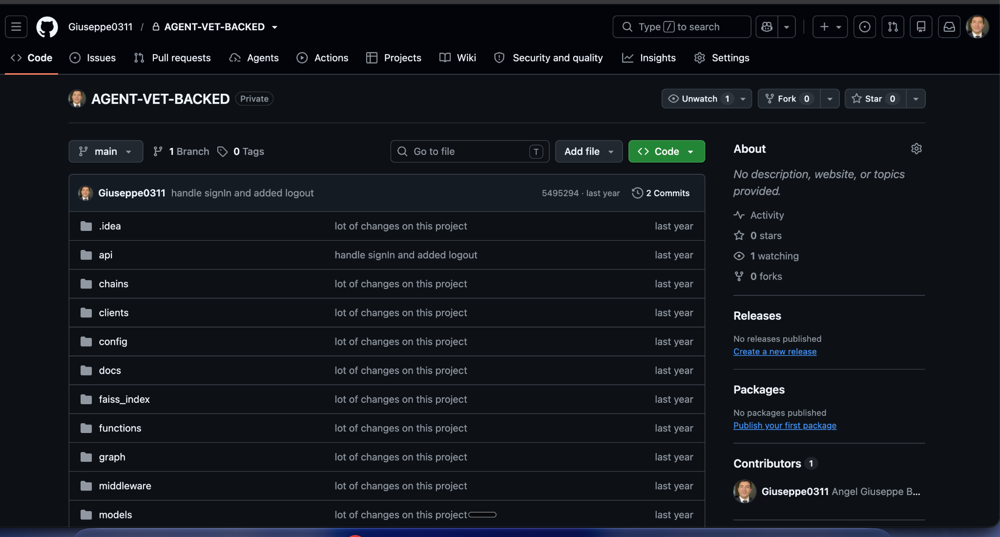
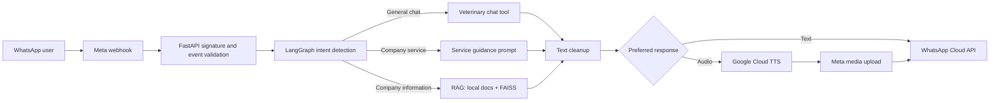

# Veterinary AI Agent for WhatsApp

**A conversational veterinary assistant that brings guided customer support to WhatsApp.**

Veterinary AI Agent for WhatsApp is an early-stage hobby project that explores how an AI agent can make veterinary customer service feel more natural. Instead of navigating menus, pet owners send a WhatsApp message; the assistant identifies what they need, routes the conversation to a specialized workflow, and replies with relevant guidance or company information.

> **Project status:** experimental prototype. The core WhatsApp, routing, RAG, and response-format paths exist in the codebase, but the project still needs configuration hardening, automated tests, deployment documentation, and production safeguards.



## What it does

The current implementation can:

- receive and verify Meta WhatsApp webhook events;
- reject invalid signatures, stale messages, and duplicate message IDs;
- use a LangGraph workflow to classify messages as general chat, a company-service request, or a company-information request;
- preserve conversation state per WhatsApp user with an in-memory LangGraph checkpointer;
- answer veterinary chat through an OpenAI model and a constrained LangChain tool;
- retrieve company information from local text documents using OpenAI embeddings and a FAISS index;
- generate service-oriented veterinary guidance with a dedicated prompt;
- send replies through the WhatsApp Cloud API;
- authenticate company users with Supabase and expose company, service, and document-management endpoints.

### Audio and text responses

The repository already contains an **experimental scaffold** for an audio/text path. The intent classifier preserves a response preference and can switch it when a user explicitly asks for text or audio. The intended audio flow synthesizes speech with Google Cloud Text-to-Speech, uploads it to Meta, and sends it through WhatsApp.

This path is **not runnable as shipped**. The preference defaults to audio, the Google TTS client is created during module import, its dependency is absent from `requirements.txt`, and the client receives a credential filename where the SDK expects a credentials object. Fixing initialization and configuration is required before either the webhook or audio flow can be demonstrated reliably. Context-aware format selection beyond an explicit user preference remains roadmap work.

## How a message moves through the system



Conversation history is scoped by the sender's WhatsApp ID. When the stored history reaches ten messages, the workflow attempts to replace it with a concise summary before continuing.

## Architecture

| Layer | Responsibility |
| --- | --- |
| `main.py` | FastAPI application, router registration, webhook verification, and signed event handling |
| `graph/` | LangGraph state definition, conditional routing, and in-memory checkpointing |
| `nodes/` | Intent detection and the three response workflows |
| `chains/` and `functions/` | RAG chain, message-history handling, and route selection |
| `prompts/` and `tools/` | Model instructions and the veterinary chat tool |
| `utils/` | WhatsApp transport, HMAC validation, document processing, and output cleanup |
| `api/`, `services/`, `clients/` | Supabase-backed authentication, company data, services, and document storage |
| `docs/` and `faiss_index/` | Prototype knowledge documents and the persisted FAISS index |

## Technology

- Python and FastAPI
- LangGraph and LangChain
- OpenAI chat models and embeddings
- Meta WhatsApp Cloud API
- FAISS vector search
- Supabase Auth, Database, and Storage
- Google Cloud Text-to-Speech for the experimental audio path

## Local setup

### 1. Create an environment

```bash
python -m venv .venv
source .venv/bin/activate
pip install -r requirements.txt
pip install google-cloud-texttospeech python-multipart "uvicorn[standard]"
```

The second command supplies startup dependencies that are currently missing from `requirements.txt`. Pin them before treating the environment as reproducible.

> **Known startup blocker:** installing these packages is necessary but not sufficient. `services/tts_service.py` initializes Google TTS eagerly with an invalid credential argument. Refactor it to use Application Default Credentials or a loaded service-account credentials object—and preferably initialize it lazily—before starting the API.

### 2. Configure environment variables

Create a local `.env` file (already ignored by Git) and provide your own values:

```dotenv
OPENAI_API_KEY=

WHATSAPP_VERIFY_TOKEN=
APP_SECRET=
PHONE_NUMBER_ID=
ACCESS_TOKEN=

SUPABASE_URL=
SUPABASE_SERVICE_ROLE=
SUPABASE_JWT_SECRET=
```

Never commit API keys, service-role tokens, JWT secrets, or cloud credential files. The current TTS service expects a local Google credential file under `keys/`; replace that prototype-specific path with an environment-based credential strategy before deployment.

### 3. Prepare external services

You will need:

1. a Meta app with a WhatsApp Business phone number and webhook subscription;
2. an OpenAI API key;
3. a Supabase project with the tables and storage bucket referenced by the service layer;
4. Google Cloud Text-to-Speech credentials while the current eager import remains in place.

The repository does not currently include database migrations or a complete Supabase schema, so the required tables must be inferred from the service layer before running those endpoints.

### 4. Start the API

After installing an ASGI server such as Uvicorn:

```bash
uvicorn main:app --reload
```

Expose the server over HTTPS and configure Meta to use:

```text
GET  /webhook   # webhook verification
POST /webhook   # incoming WhatsApp events
```

Once the TTS initialization blocker above is fixed, FastAPI's interactive API documentation is available at `/docs` while the application is running.

## API surface

Besides the WhatsApp webhook, the prototype registers endpoints for:

- authentication login and logout;
- company and company-detail lookup;
- company-service lookup;
- authenticated document upload, listing, signed URLs, and deletion.

Document uploads currently accept PDF or TXT files, with a maximum of three active documents and a combined size limit of 3 MB per company user.

## Current limitations

- No automated test suite is included.
- Conversation checkpoints and duplicate-message tracking live in process memory and are lost on restart.
- The RAG workflow uses two local text files and a prebuilt local FAISS index rather than uploaded company documents.
- The committed FAISS index is loaded from a pickle with `allow_dangerous_deserialization=True`. Treat it as trusted prototype data only; never replace it with an index from an untrusted source. A reproducible index-rebuild command is not yet documented.
- Several company lookup endpoints are publicly accessible in the current router configuration.
- The requirements and setup are incomplete for audio, multipart forms, and serving the ASGI application.
- The prototype logs message and model data with `print`, which is not appropriate for production privacy or observability.
- Veterinary responses are AI-generated and must not replace professional diagnosis or emergency care.

## Roadmap

- [ ] Make audio-versus-text selection context-aware and user-configurable.
- [ ] Move credentials and TTS configuration to a secure, environment-driven setup.
- [ ] Connect uploaded company documents to isolated, per-company RAG indexes.
- [ ] Persist conversation state and message idempotency outside the application process.
- [ ] Add tests for webhook validation, graph routing, RAG, and WhatsApp payloads.
- [ ] Add database migrations and reproducible deployment documentation.
- [ ] Strengthen authorization, privacy controls, logging, and failure handling.
- [ ] Add human handoff and safe escalation for veterinary emergencies.

## Why this project?

The repository name is intentionally descriptive so recruiters and engineers can immediately identify its domain, interface, and AI-agent focus. A concise GitHub repository slug would be `veterinary-ai-agent`.

## Disclaimer

This repository is an educational hobby project and a work in progress. It is not a medical device and should not be used as a substitute for a licensed veterinarian.
